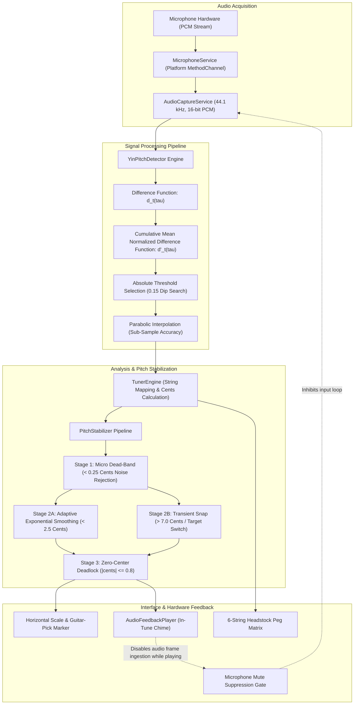

<div align="center">

  

  # ResoHertz

  **Digital Signal Processing Guitar Tuner & Pitch Estimation Architecture**

  [](https://github.com)
  [](https://github.com)
  [](https://github.com)
  [](https://github.com)

</div>

---

## System Architecture

ResoHertz is an offline digital signal processing application for monophonic fundamental frequency estimation, guitar string tracking, and real-time transient stabilization.

The following UML flowchart outlines the data pipeline from raw audio ingestion to visualization and feedback suppression:



---

## Technical Specifications

| Parameter | Specification |
| :--- | :--- |
| **Audio Ingestion** | 44,100 Hz, 16-bit Signed Linear PCM, Mono Channel |
| **Analysis Window** | 2,048 samples (~46.4 ms buffer duration) |
| **Algorithm** | YIN Fundamental Frequency Estimator with Parabolic Interpolation |
| **Detection Bandwidth** | 60.0 Hz to 450.0 Hz (covers C2 to A4 register) |
| **CMNDF Threshold** | 0.15 strict fundamental extraction |
| **In-Tune Tolerance** | +/- 3.0 Cents window |
| **Stabilizer Dead-Band** | 0.25 Cents sub-acoustic noise gate |
| **Reference Calibration** | 415.0 Hz to 466.0 Hz (Default: A4 = 440.0 Hz) |
| **Acoustic Feedback Protection** | Dynamic frame discard during chime playback |

---

## Functional Subsystems

### 1. Pitch Detection Engine
- Implements cumulative mean normalized difference processing over real-time PCM ring buffers.
- Applies parabolic fitting on candidate minima to achieve continuous sub-cent frequency resolution.
- Enforces an absolute minimum energy threshold to prevent false positives from ambient room sound.

### 2. Dual-Stage Pitch Stabilizer
- **Acoustic Dead-Band**: Discards sub-cent acoustic noise in quiet environments to prevent indicator flutter.
- **Adaptive Smoothing**: Dynamically weighs previous and current pitch estimates based on rate of change.
- **Transient Snap**: Bypasses smoothing and snaps instantly to the target frequency when string transitions or large pitch variations exceed 7.0 cents.
- **In-Tune Lock**: Locks the visual indicator directly to zero deviation when pitch settles inside the target dead-zone.

### 3. Feedback Suppression System
- Prevents infinite acoustic resonance when the completion chime sounds through device speakers.
- The audio capture pipeline drops incoming microphone buffers for the duration of the audio feedback envelope, preserving pitch detector stability.

### 4. Headstock Visualizer & Tuning Profiles
- Maps detected frequencies to equal-tempered targets across 8 standard and alternate tuning configurations (Standard, Drop D, Half-Step Down, D Standard, Drop C, DADGAD, Open D, Open G).
- Fully supports custom tuning profiles with user-defined target notes, octaves, and string assignments.

---

## Module Layout

```
lib/
├── audio/
│   ├── audio_capture_service.dart
│   ├── audio_feedback_player.dart
│   └── microphone_service.dart
├── pitch/
│   ├── note_model.dart
│   ├── pitch_tracker.dart
│   └── yin_pitch_detector.dart
├── settings/
│   ├── app_settings.dart
│   ├── app_settings_service.dart
│   └── settings_dialog.dart
├── tuner/
│   ├── horizontal_tuning_scale.dart
│   ├── pitch_stabilizer.dart
│   └── tuner_engine.dart
├── tuning/
│   ├── custom_tuning_storage.dart
│   ├── guitar_string.dart
│   ├── reference_frequency.dart
│   └── tuning_preset.dart
├── logo.png
└── main.dart
```

---

## Legal Warning & Proprietary Rights Notice

**Copyright © BAZUD3V. All Rights Reserved.**

This software, its design, source code, architecture, algorithms, and visual assets are the exclusive intellectual property of **BAZUD3V**.

- **No License Granted**: No individual, entity, or organization is granted permission to copy, reproduce, clone, modify, distribute, publish, sublicense, decompile, disassemble, or reverse engineer any part of this project.
- **Strict Prohibition**: Unauthorized usage, redistribution, commercialization, or public reproduction of this codebase, in whole or in part, is strictly prohibited.
- **Legal Action**: Any unauthorized copying, duplication, or misappropriation of this work discovered in public or private repositories, application stores, or commercial distributions will be met with immediate legal prosecution, injunctions, and claims for statutory damages to the fullest extent permitted by applicable domestic and international intellectual property laws.
