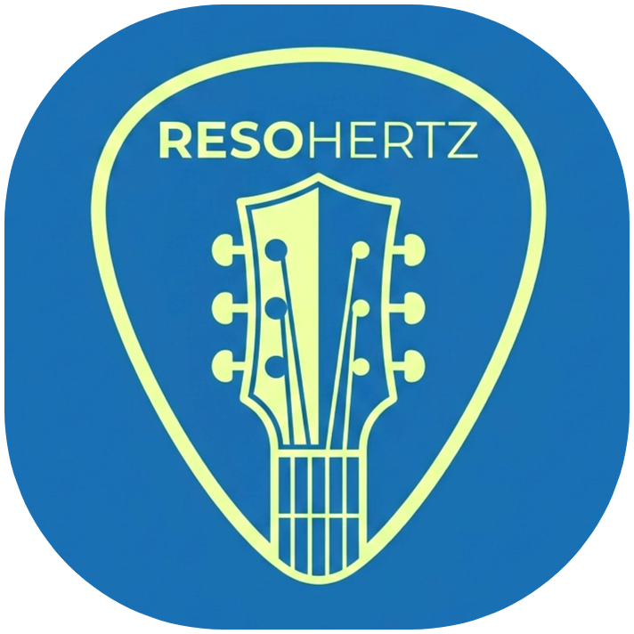
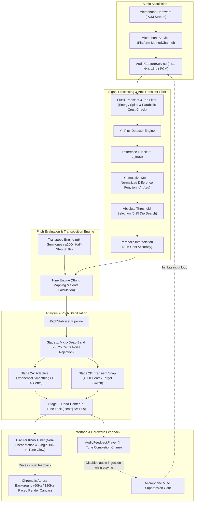

<div align="center">

  

  # ResoHertz

  **Precision Digital Signal Processing Guitar Tuner & Pitch Estimation Architecture**

  [](https://github.com)
  [](https://github.com)
  [](https://github.com)
  [](https://github.com)
  [](https://github.com)

</div>

---

## System Architecture

ResoHertz is an offline digital signal processing application engineered for ultra-precise monophonic fundamental frequency estimation, guitar string tracking, transient stabilization, and real-time visual feedback.

The following UML flowchart outlines the data pipeline from raw audio ingestion to visualization, transposition, and feedback suppression:



---

## Technical Specifications

| Parameter | Specification |
| :--- | :--- |
| **Audio Ingestion** | 44,100 Hz, 16-bit Signed Linear PCM, Mono Channel |
| **Analysis Window** | 2,048 samples (~46.4 ms buffer duration) |
| **Pitch Detection Algorithm** | YIN Fundamental Frequency Estimator with Sub-Sample Parabolic Fitting |
| **Transient Filtering** | Pluck burst rejection & percussive tap suppression gate |
| **Detection Bandwidth** | 60.0 Hz to 450.0 Hz (covers C2 to A4 register) |
| **CMNDF Threshold** | 0.15 strict fundamental dip selection |
| **Dead-Center In-Tune Threshold** | **±1.0 Cent** dead-band with ±1.5 Cent release hysteresis |
| **Visual Center Indicator** | Single dead-center bar glow upon in-tune state |
| **Transposition Range** | ±6 Semitones (Half-Step shifts from −600¢ to +600¢) |
| **Stabilizer Dead-Band** | 0.25 Cents sub-acoustic noise gate |
| **Reference Calibration** | 415.0 Hz to 466.0 Hz (Default: A4 = 440.0 Hz; Verdi 432 Hz supported) |
| **Display Optimization** | Optimized for 60 Hz and 120 Hz high-refresh AMOLED screens |
| **Acoustic Feedback Protection** | Dynamic frame discard during completion chime playback |

---

## Core Subsystems & Features

### 1. High-Accuracy YIN Pitch Detector & Tap Suppression
- **Cumulative Mean Normalized Difference**: Identifies the primary fundamental frequency dip with sub-sample parabolic interpolation.
- **Percussive Noise & Tap Rejection**: Rejects rapid body taps, accidental knock transients, and pick-scrape bursts, ensuring the tuner responds exclusively to sustained harmonic vibrations.
- **Dynamic Energy Gating**: Eliminates false positives from ambient room sound and electrical background floor.

### 2. Dead-Center Precision In-Tune Detection (±1.0 Cent)
- **Dead-Center In-Tune Window**: Tightened from traditional ±3 cents down to **±1.0 cent** for concert-grade intonation.
- **Hysteresis Threshold**: Uses a dual-stage clamp (±1.0¢ enter, ±1.5¢ leave) to prevent rapid flickering between `IN TUNE`, `FLAT`, and `SHARP`.
- **Pinpoint Center Glow**: Only the true center calibration tick lights up with emerald glow when in tune, providing instant, unambiguous visual confirmation.

### 3. Smooth Circular Knob Tuner & 120Hz Aurora Canvas
- **Circular Knob Gauge**: Features calibrated graduation marks, non-linear angular damping, and smooth continuous needle motion without erratic jumping.
- **Decay Hold & Flutter Suppression**: During natural string resonance decay, the visual pointer holds stable rather than oscillating wildly.
- **High-Refresh Rate Optimization**: Tailored for 60Hz and 120Hz displays with frame-time pacing and modal sheet repaint isolation, ensuring zero dropped frames when browsing tuning presets.

### 4. Interactive Half-Step Transpose Drawer
- **Half-Step Pitch Shift**: Dedicated `-½` and `+½` stepper controls inside the bottom tuning drawer adjust the pitch up or down by semitones (±100 cents).
- **Dynamic Note Recalculation**: Automatically updates target MIDI notes, octaves, and enharmonic labels (e.g., Standard EADGBE $\rightarrow$ Half-Step Down E♭ A♭ D♭ G♭ B♭ E♭ $\rightarrow$ D Standard, or Capo shifts).
- **Live Preview & Quick Reset**: Real-time string note badge display with a one-tap `RESET (0)` restore button.

### 5. Acoustic Feedback Suppression
- Prevents microphone feedback loops when the target note success chime plays through device speakers.
- Incoming audio ingestion is temporarily inhibited during playback, guaranteeing uncorrupted pitch tracking.

---

## Module Layout

```
lib/
├── audio/
│   ├── audio_capture_service.dart
│   ├── audio_feedback_player.dart
│   └── microphone_service.dart
├── pitch/
│   ├── note_model.dart
│   ├── pitch_tracker.dart
│   └── yin_pitch_detector.dart
├── settings/
│   ├── app_settings.dart
│   ├── app_settings_service.dart
│   └── settings_dialog.dart
├── tuner/
│   ├── circular_knob_tuner.dart
│   ├── guitar_pick_indicator.dart
│   ├── horizontal_tuning_scale.dart
│   ├── pitch_stabilizer.dart
│   ├── tuner_engine.dart
│   └── tuning_result.dart
├── tuning/
│   ├── custom_tuning_storage.dart
│   ├── guitar_string.dart
│   ├── reference_frequency.dart
│   └── tuning_preset.dart
├── ui/
│   ├── aurora_mesh_background.dart
│   └── svg_path_parser.dart
├── logo.png
└── main.dart
```

---

## Legal Warning & Proprietary Rights Notice

**Copyright © BAZUD3V. All Rights Reserved.**

This software, its design, source code, architecture, algorithms, and visual assets are the exclusive intellectual property of **BAZUD3V**.

- **No License Granted**: No individual, entity, or organization is granted permission to copy, reproduce, clone, modify, distribute, publish, sublicense, decompile, disassemble, or reverse engineer any part of this project.
- **Strict Prohibition**: Unauthorized usage, redistribution, commercialization, or public reproduction of this codebase, in whole or in part, is strictly prohibited.
- **Legal Action**: Any unauthorized copying, duplication, or misappropriation of this work discovered in public or private repositories, application stores, or commercial distributions will be met with immediate legal prosecution, injunctions, and claims for statutory damages to the fullest extent permitted by applicable domestic and international intellectual property laws.
